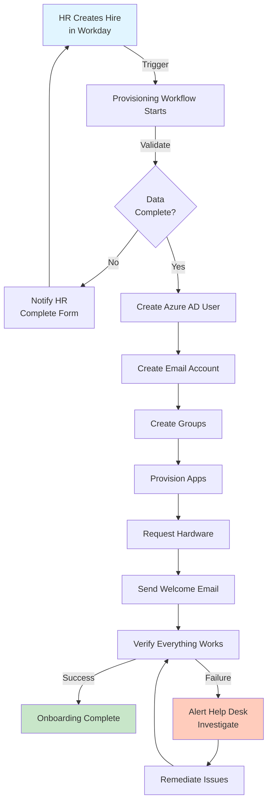
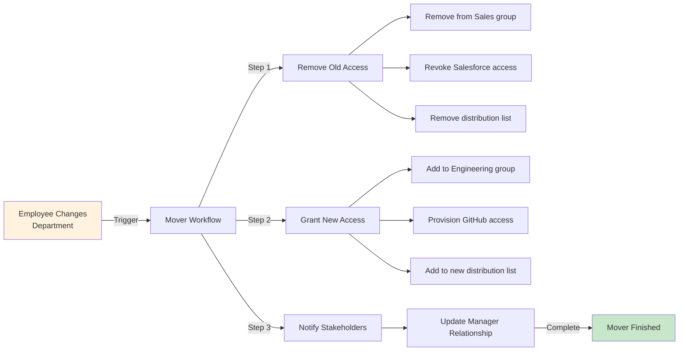
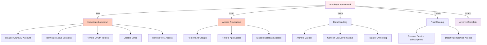
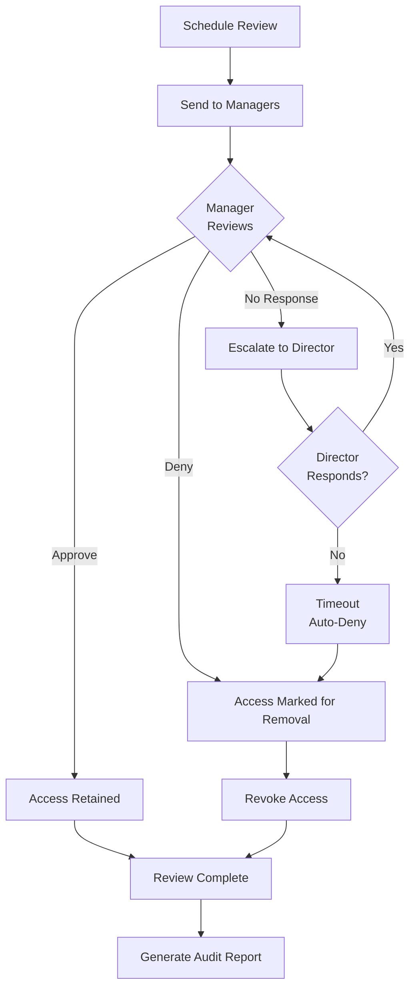

# User Provisioning Flow Diagram

## Joiner Workflow (Complete User Lifecycle)

**Timeline:** 1-2 hours total  
**Manual effort:** ~10 minutes

---

## Mover Workflow (Role Change)

**Timeline:** 30-45 minutes  
**Manual effort:** 0 minutes

---

## Leaver Workflow (Offboarding)

**Timeline:** Critical access removed within 4 hours  
**Manual effort:** 30 minutes verification

---

## Access Review Cycle

**Frequency:** Quarterly for all users  
**Effort:** 10 min per manager per review

