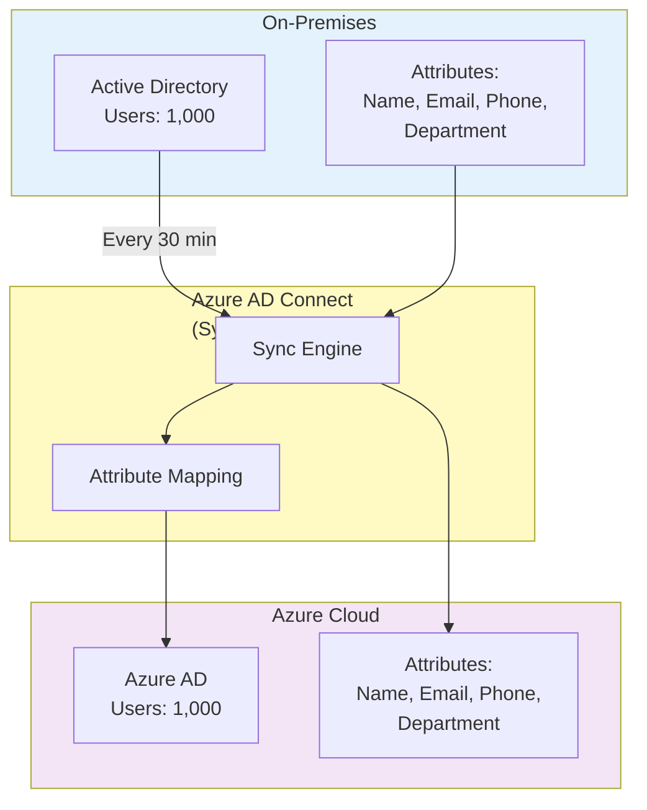
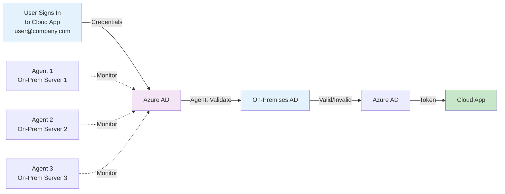
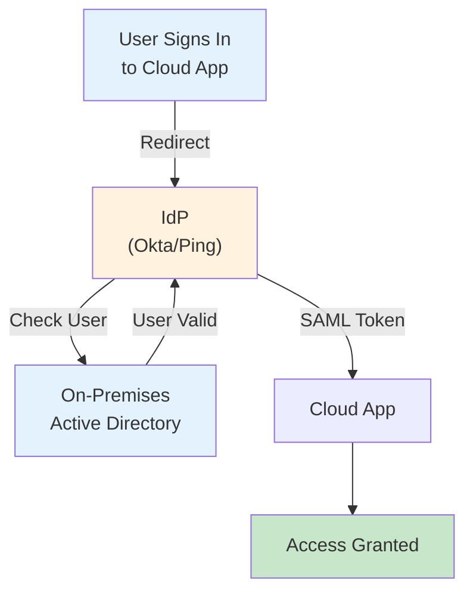
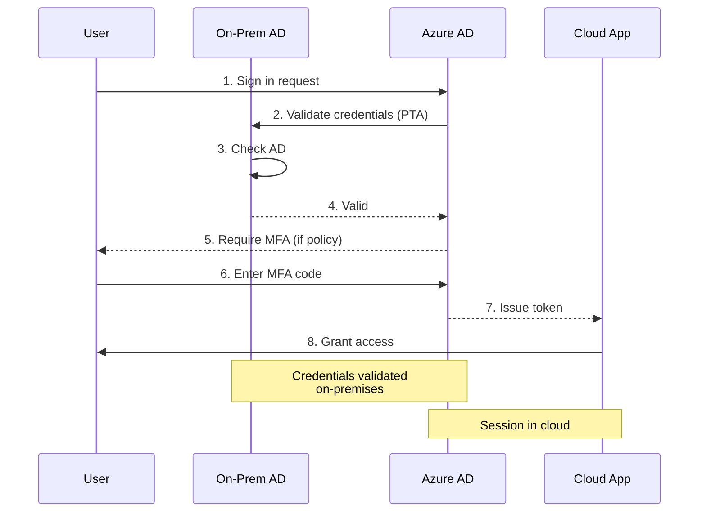

# Hybrid Identity Architecture Diagrams

## Hybrid Sync Model (Most Common)



**Use Case:** 80% of enterprises  
**Benefit:** Single source of truth (on-prem), cloud backup  
**Latency:** 30 min sync interval

---

## Pass-Through Auth (Higher Security)



**Use Case:** High-security + on-prem control  
**Benefit:** Password never in cloud, real-time validation  
**Latency:** <100ms

---

## Federated (Okta/Ping/Keycloak)



**Use Case:** Multi-cloud, legacy systems  
**Benefit:** Centralized authentication, advanced features  
**Latency:** Depends on IdP configuration

---

## Hybrid Sign-In Experience



---

## Attribute Mapping Example

| Source | Mapping | Target | Sync Status |
|--------|---------|--------|------------|
| AD: givenName | → | Azure AD: givenName | ✅ |
| AD: sn | → | Azure AD: surname | ✅ |
| AD: mail | → | Azure AD: userPrincipalName | ✅ |
| AD: dept | → | Azure AD: department | ✅ |
| AD: manager | → | Azure AD: manager | ✅ |
| AD: mobile | → | Azure AD: mobilePhone | ✅ |

**Custom Mapping Example:**
```
AD: extensionAttribute1 → Azure AD: employeeId
AD: extensionAttribute2 → Azure AD: costCenter
```

