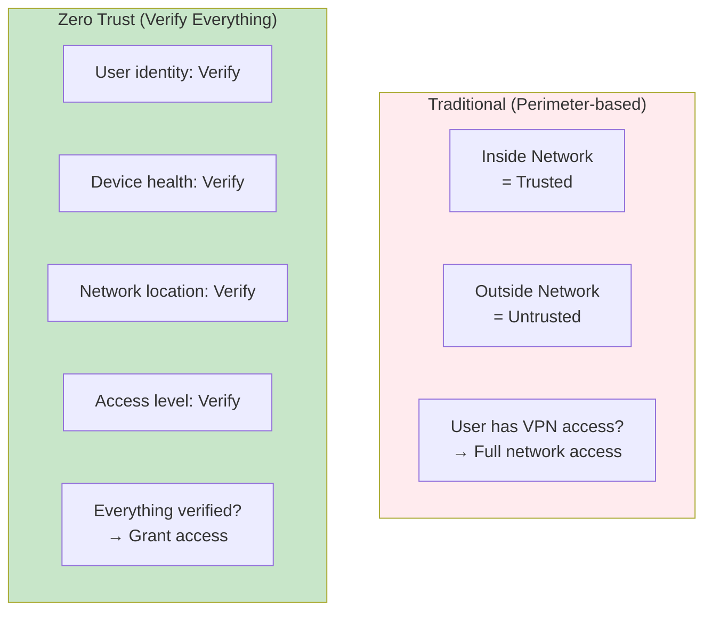
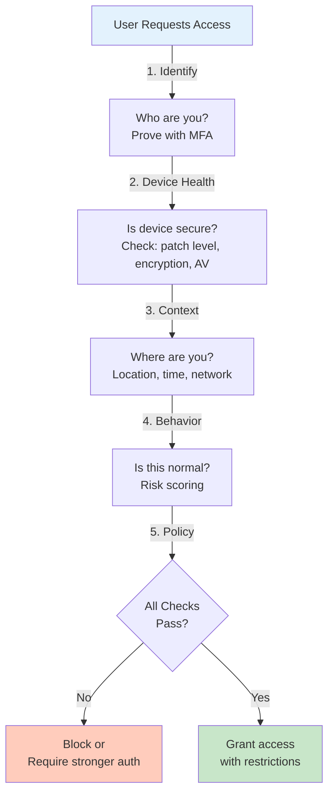
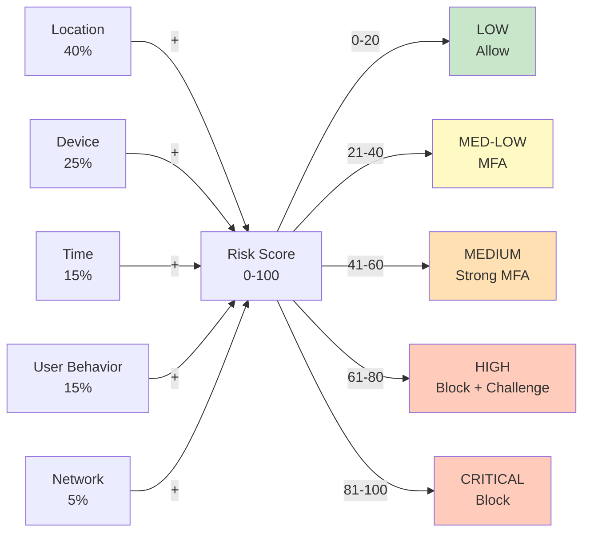

# Zero Trust Architecture Diagrams

## Zero Trust Principles vs Traditional Perimeter



---

## Zero Trust Authentication Flow



---

## Conditional Access Policy Examples

### Policy 1: Baseline (Standard User)
```
Condition: User risk = LOW, Sign-in risk = LOW
Result: Allow (no MFA required)
```

### Policy 2: Elevated Risk
```
Condition: User risk = MEDIUM OR Sign-in risk = MEDIUM
Result: Require MFA (TOTP or SMS)
```

### Policy 3: High Risk
```
Condition: User risk = HIGH OR Sign-in risk = HIGH
Result: Require FIDO2 hardware key + security questions
```

### Policy 4: Critical Risk
```
Condition: Impossible travel OR Multiple high-risk signals
Result: Block + Require admin approval
```

---

## Risk Scoring Components



